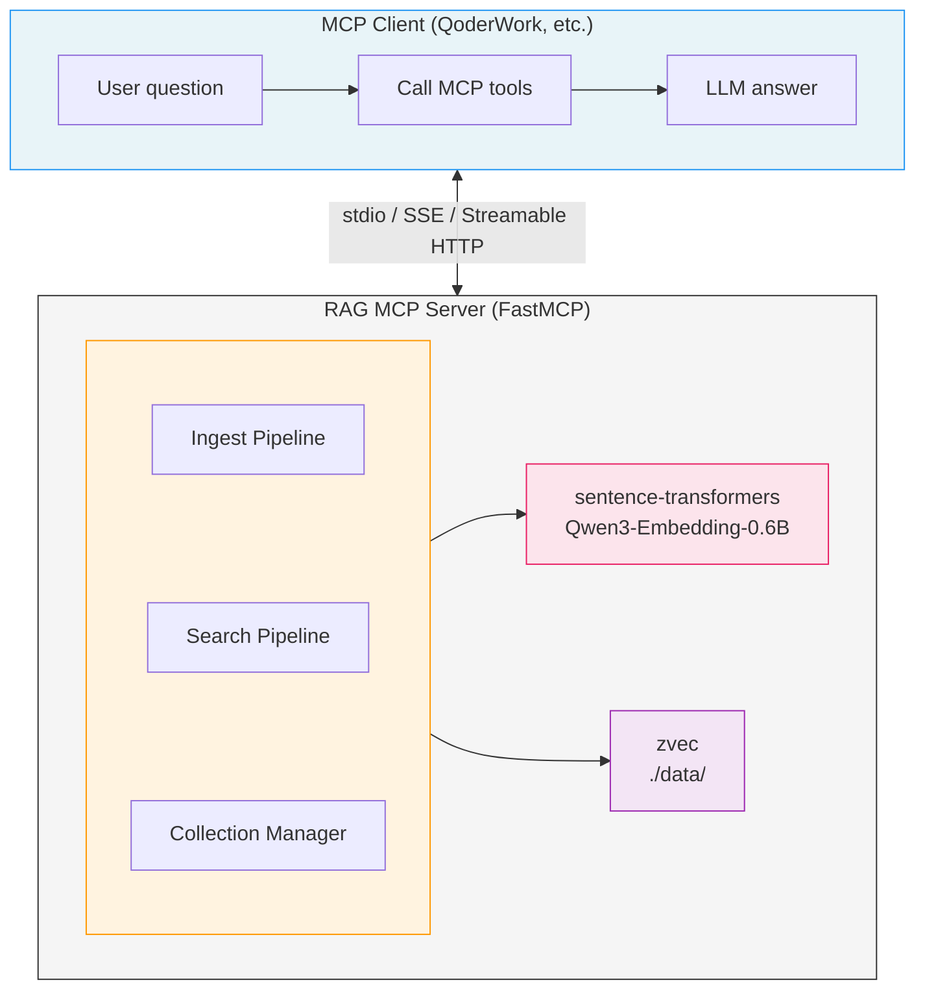

**English** | [中文](README_CN.md)

# wandering-rag-mcp

A local RAG (Retrieval-Augmented Generation) knowledge base MCP server that exposes semantic document search as tools. Uses [zvec](https://github.com/alibaba/zvec) (Alibaba's embedded vector database) for vector storage and [Qwen3-Embedding-0.6B](https://huggingface.co/Qwen/Qwen3-Embedding-0.6B) for text embedding.

No external LLM required — the MCP server handles retrieval, and the client (QoderWork, Claude Desktop, etc.) provides generation.

## Features

- **Multi-format support**: Plain text files (40+ types: md, txt, py, js, ts, go, rs, etc.) and binary documents (PDF, DOCX, PPTX, XLSX)
- **Embedded vector DB**: zvec — zero-config, no Docker, WAL-persistent, HNSW-indexed
- **Local embedding**: Qwen3-Embedding-0.6B (0.6B params, 1024-dim, 32K context, bilingual CN/EN)
- **Three transport modes**: stdio, SSE, Streamable HTTP
- **Multi-collection**: Isolate documents into separate knowledge bases

## Quick Start

### Prerequisites

- Python >= 3.10

### Install

```bash
git clone <repo-url>
cd wandering-rag-mcp
pip install -e .
```

### Run

```bash
# stdio mode (default, for QoderWork / Claude Desktop)
python server.py

# SSE mode
python server.py --mode sse --port 8000

# Streamable HTTP mode
python server.py --mode streamable-http --host 0.0.0.0 --port 8000
```

Environment variables are also supported:

| Variable | Description | Default |
|---|---|---|
| `RAG_MCP_MODE` | Transport mode | `stdio` |
| `RAG_MCP_HOST` | Bind host | `127.0.0.1` |
| `RAG_MCP_PORT` | Bind port | `8000` |
| `RAG_EMBEDDING_MODEL` | Embedding model name | `Qwen/Qwen3-Embedding-0.6B` |
| `RAG_DATA_DIR` | Vector data directory | `./data` |

## Client Configuration

### stdio Mode (QoderWork / Claude Desktop)

```json
{
  "mcpServers": {
    "wandering-rag-mcp": {
      "command": "python",
      "args": ["D:\\repos\\rag-mcp\\server.py"]
    }
  }
}
```

### SSE Mode

```json
{
  "mcpServers": {
    "wandering-rag-mcp": {
      "url": "http://your-server:8000/sse"
    }
  }
}
```

### Streamable HTTP Mode

```json
{
  "mcpServers": {
    "wandering-rag-mcp": {
      "url": "http://your-server:8000/mcp"
    }
  }
}
```

## MCP Tools

### `search`

Search the knowledge base with natural language queries.

| Parameter | Type | Default | Description |
|---|---|---|---|
| `query` | string | (required) | Natural language search query |
| `top_k` | int | 5 | Number of results to return |
| `collection` | string | `"default"` | Collection to search |

### `ingest_file`

Import a single file into the knowledge base.

| Parameter | Type | Default | Description |
|---|---|---|---|
| `filepath` | string | (required) | Path to the file |
| `collection` | string | `"default"` | Target collection |
| `chunk_size` | int | 500 | Max characters per chunk |

Supported formats: `.md`, `.txt`, `.py`, `.js`, `.ts`, `.pdf`, `.docx`, `.pptx`, `.xlsx`, and 40+ more.

### `ingest_directory`

Batch import all files in a directory.

| Parameter | Type | Default | Description |
|---|---|---|---|
| `dirpath` | string | (required) | Directory path |
| `collection` | string | `"default"` | Target collection |
| `recursive` | bool | `true` | Scan subdirectories |
| `extensions` | string | `""` | Comma-separated extensions filter (empty = all supported) |
| `chunk_size` | int | 500 | Max characters per chunk |

### `list_collections`

List all knowledge base collections.

### `list_documents`

List all documents in a collection.

| Parameter | Type | Default | Description |
|---|---|---|---|
| `collection` | string | `"default"` | Collection name |

### `delete_document`

Remove a document and all its chunks from the knowledge base.

| Parameter | Type | Default | Description |
|---|---|---|---|
| `filepath` | string | (required) | Path used during import |
| `collection` | string | `"default"` | Collection name |

## Architecture



### Project Structure

```
wandering-rag-mcp/
├── pyproject.toml          # Dependencies and entry point
├── server.py               # MCP server entry + 6 tool definitions
├── core/
│   ├── chunker.py          # Recursive text chunking
│   ├── embeddings.py       # sentence-transformers wrapper (lazy load)
│   └── vector_store.py     # zvec wrapper (CRUD + search)
├── data/                   # zvec storage (auto-created at runtime)
│   └── default/
└── .gitignore
```

## How It Works

1. **Ingest**: File is read (plain text or converted via markitdown) → split into overlapping chunks → each chunk embedded into a 1024-dim vector → stored in zvec with metadata (text, source path, chunk index)

2. **Search**: Query text → embedded into vector → zvec ANN search returns top-k nearest chunks with similarity scores → returned as formatted text with source references

3. **Document ID**: SHA256 hash of the file path (first 16 chars) is used as a stable document ID, enabling idempotent re-imports and deletion by file path.

## Dependencies

| Package | Purpose |
|---|---|
| `mcp` | MCP protocol SDK (FastMCP) |
| `zvec` | Embedded vector database by Alibaba |
| `sentence-transformers` | Load and run embedding models |
| `markitdown[all]` | Convert PDF/DOCX/PPTX/XLSX to Markdown |

## Technical Documentation

For detailed architecture and technical stack explanation, see [Architecture Document](docs/architecture.md).

## License

MIT
