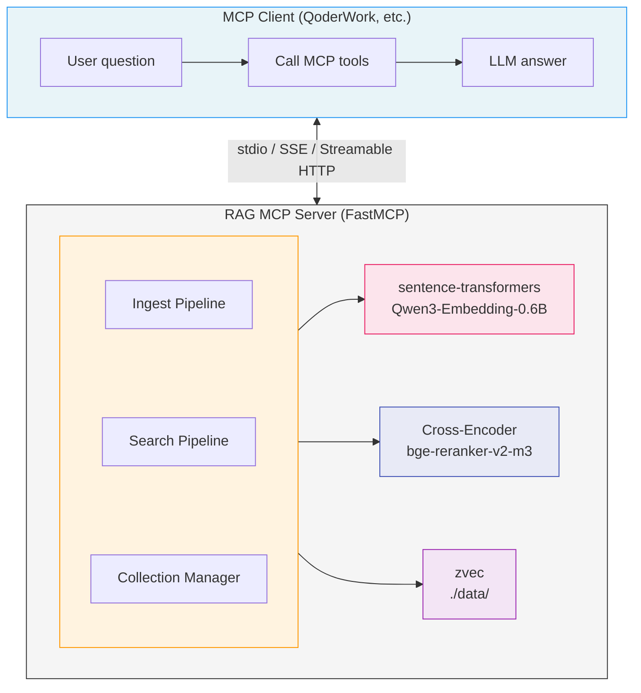

**English** | [中文](README_CN.md)

# wandering-rag-mcp

A local RAG (Retrieval-Augmented Generation) knowledge base MCP server that exposes semantic document search as tools. Uses [zvec](https://github.com/alibaba/zvec) (Alibaba's embedded vector database) for vector storage and [Qwen3-Embedding-0.6B](https://huggingface.co/Qwen/Qwen3-Embedding-0.6B) for text embedding.

No external LLM required — the MCP server handles retrieval, and the client (QoderWork, Claude Desktop, etc.) provides generation.

## Features

- **Multi-format support**: Plain text files (40+ types: md, txt, py, js, ts, go, rs, etc.) and binary documents (PDF, DOCX, PPTX, XLSX)
- **Embedded vector DB**: zvec — zero-config, no Docker, WAL-persistent, HNSW-indexed
- **Local embedding**: Qwen3-Embedding-0.6B (0.6B params, 1024-dim, 32K context, bilingual CN/EN)
- **Optional reranker**: bge-reranker-v2-m3 cross-encoder for higher retrieval accuracy
- **REST API**: HTTP endpoints for document management (upload/search/delete), runs alongside MCP on the same port
- **Three transport modes**: stdio, SSE, Streamable HTTP
- **Multi-collection**: Isolate documents into separate knowledge bases

## Quick Start

### Prerequisites

- Python >= 3.10

### Install

```bash
git clone <repo-url>
cd wandering-rag-mcp
pip install -e .
```

### Run

```bash
# stdio mode (default, for QoderWork / Claude Desktop)
python server.py

# SSE mode
python server.py --mode sse --port 8000

# Streamable HTTP mode
python server.py --mode streamable-http --host 0.0.0.0 --port 8000

# Disable REST API (MCP only)
python server.py --mode sse --no-api
```

Environment variables are also supported:

| Variable | Description | Default |
|---|---|---|
| `RAG_MCP_MODE` | Transport mode | `stdio` |
| `RAG_MCP_HOST` | Bind host | `127.0.0.1` |
| `RAG_MCP_PORT` | Bind port | `8000` |
| `RAG_EMBEDDING_MODEL` | Embedding model name | `Qwen/Qwen3-Embedding-0.6B` |
| `RAG_RERANKER_MODEL` | Reranker model name | `BAAI/bge-reranker-v2-m3` |
| `RAG_DATA_DIR` | Vector data directory | `./data` |
| `RAG_CORS_ORIGINS` | Allowed CORS origins (comma-separated) | `*` |

## Client Configuration

### stdio Mode (QoderWork / Claude Desktop)

```json
{
  "mcpServers": {
    "wandering-rag-mcp": {
      "command": "python",
      "args": ["D:\\repos\\rag-mcp\\server.py"]
    }
  }
}
```

### SSE Mode

```json
{
  "mcpServers": {
    "wandering-rag-mcp": {
      "url": "http://your-server:8000/sse"
    }
  }
}
```

### Streamable HTTP Mode

```json
{
  "mcpServers": {
    "wandering-rag-mcp": {
      "url": "http://your-server:8000/mcp"
    }
  }
}
```

## MCP Tools

### `search`

Search the knowledge base with natural language queries.

| Parameter | Type | Default | Description |
|---|---|---|---|
| `query` | string | (required) | Natural language search query |
| `top_k` | int | 5 | Number of results to return |
| `collection` | string | `"default"` | Collection to search |
| `rerank` | bool | `false` | Use cross-encoder reranker for higher accuracy |
| `filter` | string | `""` | Glob pattern to filter by source file (e.g. `*.md`, `**/docs/*`) |

### `ingest_file`

Import a single file into the knowledge base.

| Parameter | Type | Default | Description |
|---|---|---|---|
| `filepath` | string | (required) | Path to the file |
| `collection` | string | `"default"` | Target collection |
| `chunk_size` | int | 500 | Max characters per chunk |
| `force` | bool | `false` | Re-import even if file hasn't changed |
| `chunk_mode` | string | `"recursive"` | Chunking strategy: `recursive` (character-based splitting) or `semantic` (embedding similarity-based splitting) |

> **Change detection**: By default, files that haven't changed since last import are skipped. Use `force=true` to re-import anyway.

Supported formats: `.md`, `.txt`, `.py`, `.js`, `.ts`, `.pdf`, `.docx`, `.pptx`, `.xlsx`, and 40+ more.

### `ingest_directory`

Batch import all files in a directory.

| Parameter | Type | Default | Description |
|---|---|---|---|
| `dirpath` | string | (required) | Directory path |
| `collection` | string | `"default"` | Target collection |
| `recursive` | bool | `true` | Scan subdirectories |
| `extensions` | string | `""` | Comma-separated extensions filter (empty = all supported) |
| `chunk_size` | int | 500 | Max characters per chunk |
| `force` | bool | `false` | Re-import even if files haven't changed |
| `chunk_mode` | string | `"recursive"` | Chunking strategy: `recursive` or `semantic` |

### `list_collections`

List all knowledge base collections.

### `list_documents`

List all documents in a collection.

| Parameter | Type | Default | Description |
|---|---|---|---|
| `collection` | string | `"default"` | Collection name |

### `delete_document`

Remove a document and all its chunks from the knowledge base.

| Parameter | Type | Default | Description |
|---|---|---|---|
| `filepath` | string | (required) | Path used during import |
| `collection` | string | `"default"` | Collection name |

### `configure_collection`

Set default parameters for a knowledge base collection. Future import and search operations will use these defaults when parameters are not explicitly specified.

| Parameter | Type | Default | Description |
|---|---|---|---|
| `collection` | string | `"default"` | Collection name |
| `chunk_mode` | string | `""` | Default chunking strategy. Empty = keep current. `recursive` or `semantic` |
| `chunk_size` | int | `0` | Default max characters per chunk. 0 = keep current |
| `chunk_overlap` | int | `-1` | Default overlap characters. -1 = keep current |
| `rerank` | bool | `None` | Default whether to use reranker for search. None = keep current |
| `description` | string | `None` | Collection description. None = keep current |

### `get_collection_config`

View the current configuration for a collection.

| Parameter | Type | Default | Description |
|---|---|---|---|
| `collection` | string | `"default"` | Collection name |

## REST API

When running in SSE or Streamable HTTP mode, a REST API is automatically available at `/api/` alongside the MCP endpoint. This enables web frontends (e.g., CodingHub) to manage documents via HTTP while AI clients use MCP for search.

Disable with `--no-api` if you only need MCP.

### `GET /api/health`

Health check endpoint.

### `GET /api/collections`

List all knowledge base collections.

**Response:**
```json
[{"name": "default", "doc_count": 5}]
```

### `GET /api/collections/{name}/documents`

List all documents in a collection.

**Response:**
```json
[{"source": "/path/to/file.md", "chunk_count": 12}]
```

### `POST /api/collections/{name}/documents`

Upload a file to the knowledge base. Accepts `multipart/form-data` with a `file` field.

```bash
curl -F "file=@document.pdf" http://localhost:8000/api/collections/default/documents
```

Optional query parameters: `chunk_size` (default: 500), `chunk_mode` (`recursive` or `semantic`, default: `recursive`).

**Response:**
```json
{"status": "ok", "filename": "document.pdf", "chunks": 24}
```

### `DELETE /api/collections/{name}/documents`

Delete a document and all its chunks.

```bash
curl -X DELETE http://localhost:8000/api/collections/default/documents \
  -H "Content-Type: application/json" \
  -d '{"filepath": "/path/to/file.md"}'
```

**Response:**
```json
{"status": "ok", "filepath": "/path/to/file.md", "deleted": 12}
```

### `POST /api/collections/{name}/search`

Semantic search across the knowledge base.

```bash
curl -X POST http://localhost:8000/api/collections/default/search \
  -H "Content-Type: application/json" \
  -d '{"query": "how to install", "top_k": 5, "rerank": false, "filter": "*.md"}'
```

**Request body:**
| Field | Type | Default | Description |
|---|---|---|---|
| `query` | string | (required) | Search query |
| `top_k` | int | 5 | Number of results |
| `rerank` | bool | `false` | Use cross-encoder reranker |
| `filter` | string | `""` | Glob pattern to filter by source file path |

**Response:**
```json
[
  {"id": "...", "score": 0.85, "text": "...", "source": "file.md", "chunk_index": 3}
]
```

### `GET /api/collections/{name}/config`

Get the configuration for a collection.

**Response:**
```json
{"chunk_mode": "semantic", "chunk_size": 500, "chunk_overlap": 50, "rerank": false, "description": "Technical docs"}
```

### `PUT /api/collections/{name}/config`

Update collection configuration. Only include fields you want to change.

```bash
curl -X PUT http://localhost:8000/api/collections/default/config \
  -H "Content-Type: application/json" \
  -d '{"chunk_mode": "semantic", "description": "Technical documentation"}'
```

**Response:** Returns the full updated configuration.

### CORS

The REST API includes CORS headers by default (allows all origins). Restrict with the `RAG_CORS_ORIGINS` environment variable:

```bash
RAG_CORS_ORIGINS=http://localhost:5173,http://localhost:8080 python server.py --mode sse
```

## Architecture



### Project Structure

```
wandering-rag-mcp/
├── pyproject.toml          # Dependencies and entry point
├── server.py               # MCP server entry + 6 tool definitions + combined ASGI
├── api/
│   ├── __init__.py
│   └── app.py              # REST API routes (starlette)
├── core/
│   ├── chunker.py          # Text chunking (recursive + semantic)
│   ├── embeddings.py       # sentence-transformers wrapper (lazy load)
│   ├── reranker.py         # Cross-encoder reranker (lazy load)
│   ├── service.py          # Shared business logic (MCP + REST)
│   └── vector_store.py     # zvec wrapper (CRUD + search)
├── data/                   # zvec storage (auto-created at runtime)
│   └── default/
└── .gitignore
```

## How It Works

1. **Ingest**: File is read (plain text or converted via markitdown) → split into overlapping chunks → each chunk embedded into a 1024-dim vector → stored in zvec with metadata (text, source path, chunk index)

2. **Search**: Query text → embedded into vector → zvec ANN search returns top-k nearest chunks with similarity scores → optionally reranked by cross-encoder for higher accuracy → returned as formatted text with source references

3. **Document ID**: SHA256 hash of the file path (first 16 chars) is used as a stable document ID, enabling idempotent re-imports and deletion by file path.

## Dependencies

| Package | Purpose |
|---|---|
| `mcp` | MCP protocol SDK (FastMCP) |
| `zvec` | Embedded vector database by Alibaba |
| `sentence-transformers` | Load and run embedding models |
| `markitdown[all]` | Convert PDF/DOCX/PPTX/XLSX to Markdown |
| `python-multipart` | Multipart form parsing for REST API file uploads |

## Technical Documentation

For detailed architecture and technical stack explanation, see [Architecture Document](docs/architecture.md).

## Deployment

### Quick Install (Online)

For a clean Linux server with internet access:

```bash
curl -sSL https://raw.githubusercontent.com/mambo-wang/wandering-rag-mcp/main/deploy/setup.sh | bash
```

This installs everything: Python venv, dependencies, embedding model, and generates start scripts.

### Offline Install

For air-gapped servers, use the offline packaging scripts in `deploy/`:

```bash
# On a machine with internet: prepare the bundle (~3GB with models)
cd deploy && bash prepare.sh x86_64

# Transfer wandering-rag-mcp-offline.tar.gz to the target server, then:
tar xzf wandering-rag-mcp-offline.tar.gz
cd bundle && bash install.sh
```

See [deploy/README.md](deploy/README.md) for full deployment guide.

## License

MIT
