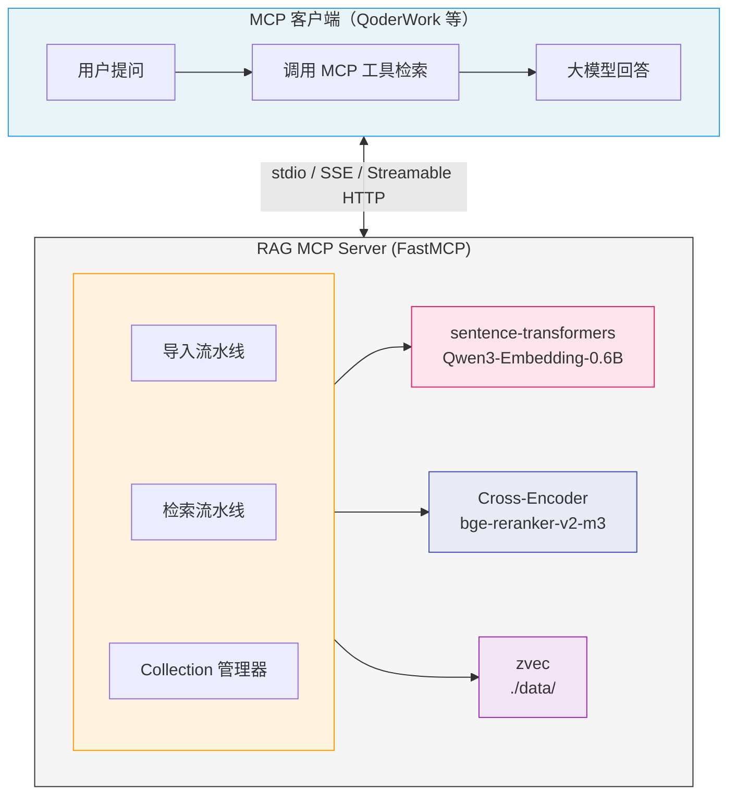

# wandering-rag-mcp

[English](README.md) | **中文**

本地 RAG（检索增强生成）知识库 MCP 服务器，通过 MCP 协议暴露语义文档搜索工具。使用阿里巴巴开源的 [zvec](https://github.com/alibaba/zvec) 嵌入式向量数据库存储向量，使用 [Qwen3-Embedding-0.6B](https://huggingface.co/Qwen/Qwen3-Embedding-0.6B) 进行文本嵌入。

无需配置外部大模型 — MCP Server 只负责检索，生成由客户端（QoderWork、Claude Desktop 等）自带的大模型完成。

## 特性

- **多格式支持**：纯文本文件（40+ 种：md、txt、py、js、ts、go、rs 等）和二进制文档（PDF、DOCX、PPTX、XLSX）
- **嵌入式向量库**：zvec — 零配置、无需 Docker、WAL 持久化、HNSW 索引
- **本地嵌入模型**：Qwen3-Embedding-0.6B（0.6B 参数、1024 维、32K 上下文、中英文双语）
- **可选 Reranker**：bge-reranker-v2-m3 交叉编码器，提升检索精度
- **REST API**：HTTP 文档管理接口（上传/搜索/删除），与 MCP 共享同一端口
- **三种传输模式**：stdio、SSE、Streamable HTTP
- **多知识库隔离**：将文档分隔到不同的 Collection 中独立检索

## 快速开始

### 环境要求

- Python >= 3.10

### 安装

```bash
git clone <repo-url>
cd wandering-rag-mcp
pip install -e .
```

### 启动

```bash
# stdio 模式（默认，用于 QoderWork / Claude Desktop）
python server.py

# SSE 模式
python server.py --mode sse --port 8000

# Streamable HTTP 模式
python server.py --mode streamable-http --host 0.0.0.0 --port 8000

# 禁用 REST API（仅 MCP）
python server.py --mode sse --no-api
```

也支持通过环境变量配置：

| 变量 | 说明 | 默认值 |
|---|---|---|
| `RAG_MCP_MODE` | 传输模式 | `stdio` |
| `RAG_MCP_HOST` | 绑定地址 | `127.0.0.1` |
| `RAG_MCP_PORT` | 绑定端口 | `8000` |
| `RAG_EMBEDDING_MODEL` | 嵌入模型名称 | `Qwen/Qwen3-Embedding-0.6B` |
| `RAG_RERANKER_MODEL` | Reranker 模型名称 | `BAAI/bge-reranker-v2-m3` |
| `RAG_DATA_DIR` | 向量数据目录 | `./data` |
| `RAG_CORS_ORIGINS` | 允许的 CORS 来源（逗号分隔） | `*` |

## 客户端配置

### stdio 模式（QoderWork / Claude Desktop）

```json
{
  "mcpServers": {
    "wandering-rag-mcp": {
      "command": "python",
      "args": ["D:\\repos\\rag-mcp\\server.py"]
    }
  }
}
```

### SSE 模式

```json
{
  "mcpServers": {
    "wandering-rag-mcp": {
      "url": "http://your-server:8000/sse"
    }
  }
}
```

### Streamable HTTP 模式

```json
{
  "mcpServers": {
    "wandering-rag-mcp": {
      "url": "http://your-server:8000/mcp"
    }
  }
}
```

## MCP 工具

### `search` — 语义搜索

在知识库中搜索与查询相关的文档片段。

| 参数 | 类型 | 默认值 | 说明 |
|---|---|---|---|
| `query` | string | （必填） | 自然语言搜索查询 |
| `top_k` | int | 5 | 返回结果数量 |
| `collection` | string | `"default"` | 搜索的知识库 |
| `rerank` | bool | `false` | 启用交叉编码器 Reranker 提升精度 |
| `filter` | string | `""` | Glob 模式按源文件过滤（如 `*.md`、`**/docs/*`） |

### `ingest_file` — 导入文件

将单个文件导入知识库。支持纯文本和二进制文档格式。

| 参数 | 类型 | 默认值 | 说明 |
|---|---|---|---|
| `filepath` | string | （必填） | 文件路径 |
| `collection` | string | `"default"` | 目标知识库 |
| `chunk_size` | int | 500 | 每块最大字符数 |
| `force` | bool | `false` | 即使文件未变更也重新导入 |
| `chunk_mode` | string | `"recursive"` | 分块策略：`recursive`（按字符递归拆分）或 `semantic`（基于语义相似度拆分） |

> **变更检测**：默认情况下，自上次导入以来未变更的文件会被跳过。使用 `force=true` 强制重新导入。

支持格式：`.md`、`.txt`、`.py`、`.js`、`.ts`、`.pdf`、`.docx`、`.pptx`、`.xlsx` 等 40+ 种。

### `ingest_directory` — 批量导入目录

将目录下所有支持的文件批量导入知识库。

| 参数 | 类型 | 默认值 | 说明 |
|---|---|---|---|
| `dirpath` | string | （必填） | 目录路径 |
| `collection` | string | `"default"` | 目标知识库 |
| `recursive` | bool | `true` | 是否扫描子目录 |
| `extensions` | string | `""` | 逗号分隔的扩展名过滤（空=全部支持格式） |
| `chunk_size` | int | 500 | 每块最大字符数 |
| `force` | bool | `false` | 即使文件未变更也重新导入 |
| `chunk_mode` | string | `"recursive"` | 分块策略：`recursive` 或 `semantic` |

### `list_collections` — 列出知识库

列出所有已创建的知识库 Collection。

### `list_documents` — 列出文档

列出知识库中已导入的所有文档。

| 参数 | 类型 | 默认值 | 说明 |
|---|---|---|---|
| `collection` | string | `"default"` | 知识库名称 |

### `delete_document` — 删除文档

从知识库中删除指定文档及其所有分块。

| 参数 | 类型 | 默认值 | 说明 |
|---|---|---|---|
| `filepath` | string | （必填） | 导入时使用的文件路径 |
| `collection` | string | `"default"` | 知识库名称 |

### `configure_collection` — 配置知识库

设置知识库的默认参数。后续导入和搜索操作如果不显式指定参数，将自动使用这些配置。

| 参数 | 类型 | 默认值 | 说明 |
|---|---|---|---|
| `collection` | string | `"default"` | 知识库名称 |
| `chunk_mode` | string | `""` | 默认分块策略，空=保持不变。`recursive` 或 `semantic` |
| `chunk_size` | int | `0` | 默认每块最大字符数，0=保持不变 |
| `chunk_overlap` | int | `-1` | 默认重叠字符数，-1=保持不变 |
| `rerank` | bool | `None` | 搜索时是否默认启用 Reranker，None=保持不变 |
| `description` | string | `None` | 知识库描述，None=保持不变 |

### `get_collection_config` — 查看知识库配置

查看知识库的当前配置参数。

| 参数 | 类型 | 默认值 | 说明 |
|---|---|---|---|
| `collection` | string | `"default"` | 知识库名称 |

## REST API

在 SSE 或 Streamable HTTP 模式下，REST API 自动在 `/api/` 路径下可用，与 MCP 端点共享同一端口。Web 前端（如 CodingHub）可通过 HTTP 管理文档，AI 客户端通过 MCP 进行检索。

使用 `--no-api` 可禁用 REST API，仅保留 MCP。

### `GET /api/health`

健康检查端点。

### `GET /api/collections`

列出所有知识库。

**响应：**
```json
[{"name": "default", "doc_count": 5}]
```

### `GET /api/collections/{name}/documents`

列出知识库中的所有文档。

**响应：**
```json
[{"source": "/path/to/file.md", "chunk_count": 12}]
```

### `POST /api/collections/{name}/documents`

上传文件到知识库。接受 `multipart/form-data` 格式，包含 `file` 字段。

```bash
curl -F "file=@document.pdf" http://localhost:8000/api/collections/default/documents
```

可选查询参数：`chunk_size`（默认：500）、`chunk_mode`（`recursive` 或 `semantic`，默认：`recursive`）。

**响应：**
```json
{"status": "ok", "filename": "document.pdf", "chunks": 24}
```

### `DELETE /api/collections/{name}/documents`

删除文档及其所有分块。

```bash
curl -X DELETE http://localhost:8000/api/collections/default/documents \
  -H "Content-Type: application/json" \
  -d '{"filepath": "/path/to/file.md"}'
```

**响应：**
```json
{"status": "ok", "filepath": "/path/to/file.md", "deleted": 12}
```

### `POST /api/collections/{name}/search`

语义搜索知识库。

```bash
curl -X POST http://localhost:8000/api/collections/default/search \
  -H "Content-Type: application/json" \
  -d '{"query": "如何安装", "top_k": 5, "rerank": false, "filter": "*.md"}'
```

**请求体：**
| 字段 | 类型 | 默认值 | 说明 |
|---|---|---|---|
| `query` | string | （必填） | 搜索查询 |
| `top_k` | int | 5 | 返回结果数量 |
| `rerank` | bool | `false` | 启用交叉编码器 Reranker |
| `filter` | string | `""` | Glob 模式按源文件路径过滤 |

**响应：**
```json
[
  {"id": "...", "score": 0.85, "text": "...", "source": "file.md", "chunk_index": 3}
]
```

### `GET /api/collections/{name}/config`

获取知识库配置。

**响应：**
```json
{"chunk_mode": "semantic", "chunk_size": 500, "chunk_overlap": 50, "rerank": false, "description": "技术文档"}
```

### `PUT /api/collections/{name}/config`

更新知识库配置。只需传入要修改的字段。

```bash
curl -X PUT http://localhost:8000/api/collections/default/config \
  -H "Content-Type: application/json" \
  -d '{"chunk_mode": "semantic", "description": "技术文档知识库"}'
```

**响应：** 返回完整的更新后配置。

### CORS

REST API 默认包含 CORS 头（允许所有来源）。通过 `RAG_CORS_ORIGINS` 环境变量限制允许的来源：

```bash
RAG_CORS_ORIGINS=http://localhost:5173,http://localhost:8080 python server.py --mode sse
```

## 架构



### 项目结构

```
wandering-rag-mcp/
├── pyproject.toml          # 依赖声明和入口点
├── server.py               # MCP 服务入口 + 6 个工具定义 + 组合 ASGI
├── api/
│   ├── __init__.py
│   └── app.py              # REST API 路由（starlette）
├── core/
│   ├── chunker.py          # 文本分块（递归字符 + 语义分块）
│   ├── embeddings.py       # sentence-transformers 封装（懒加载）
│   ├── reranker.py         # Cross-Encoder Reranker（懒加载）
│   ├── service.py          # 共享业务逻辑（MCP + REST）
│   └── vector_store.py     # zvec 封装（增删查 + 搜索）
├── data/                   # zvec 数据存储（运行时自动创建）
│   └── default/
└── .gitignore
```

## 工作原理

1. **导入**：读取文件（纯文本直接读取，二进制文档通过 markitdown 转换）→ 切分为重叠文本块 → 每块嵌入为 1024 维向量 → 连同元数据（文本、来源路径、块序号）存入 zvec

2. **检索**：查询文本 → 嵌入为向量 → zvec ANN 搜索返回候选文本块 → 可选 Cross-Encoder Reranker 精排提升精度 → 格式化为带来源引用的文本返回

3. **文档 ID**：使用文件路径的 SHA256 哈希前 16 位作为稳定的文档 ID，支持幂等重复导入和按路径删除。

## 依赖

| 包 | 用途 |
|---|---|
| `mcp` | MCP 协议 SDK（FastMCP） |
| `zvec` | 阿里巴巴开源嵌入式向量数据库 |
| `sentence-transformers` | 加载和运行嵌入模型 |
| `markitdown[all]` | 将 PDF/DOCX/PPTX/XLSX 转换为 Markdown |
| `python-multipart` | REST API 文件上传的 multipart 表单解析 |

## 技术文档

详细的项目架构和技术栈说明请参阅 [技术架构文档](docs/architecture.md)。

## 部署

### 在线安装（推荐）

适用于有网络的纯净 Linux 服务器：

```bash
curl -sSL https://raw.githubusercontent.com/mambo-wang/wandering-rag-mcp/main/deploy/setup.sh | bash
```

自动安装 Python 虚拟环境、所有依赖、嵌入模型，并生成启动脚本。

### 离线安装

适用于无网络的内网服务器，使用 `deploy/` 目录下的打包脚本：

```bash
# 在有网的机器上打包（约 3GB，含模型）
cd deploy && bash prepare.sh x86_64

# 将 wandering-rag-mcp-offline.tar.gz 拷贝到内网服务器后：
tar xzf wandering-rag-mcp-offline.tar.gz
cd bundle && bash install.sh
```

完整部署指南请参阅 [deploy/README.md](deploy/README.md)。

## 许可证

MIT
