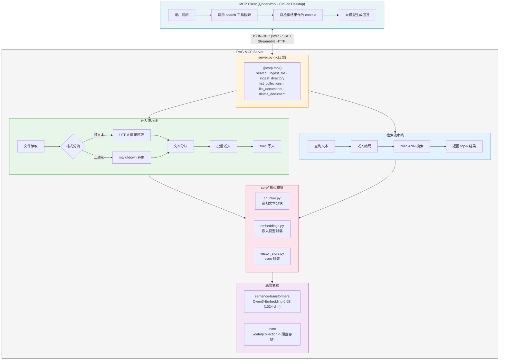
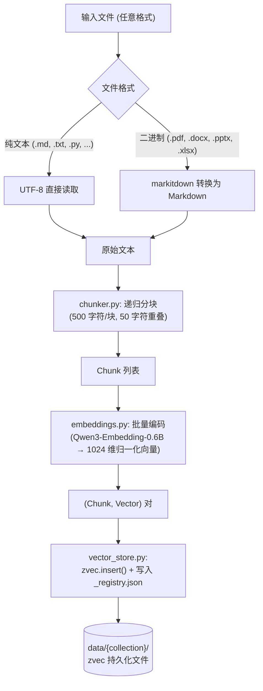
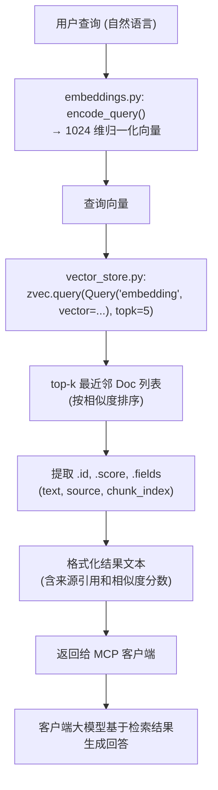

# 技术架构文档

[返回 README](../README_CN.md)

## 1. 系统概览

wandering-rag-mcp 是一个基于 MCP（Model Context Protocol）协议的本地 RAG 知识库服务器。它的职责边界很清晰：**只负责文档的索引和检索**，不参与大模型生成。生成环节由 MCP 客户端（QoderWork、Claude Desktop 等）自带的大模型完成。

这种设计带来两个好处：一是服务器本身不需要配置任何 LLM API Key，零成本运行；二是可以搭配任意客户端的大模型使用，不绑定特定供应商。

## 2. 技术栈

### 2.1 向量数据库：zvec

[zvec](https://github.com/alibaba/zvec) 是阿里巴巴开源的嵌入式向量数据库（Apache 2.0），定位类似"向量数据库中的 SQLite"。

选择 zvec 的核心理由：

- **嵌入式架构**：`pip install zvec` 即可使用，无需 Docker、无需独立服务进程，与 MCP Server 同进程运行，零网络开销
- **WAL 持久化**：基于预写日志（Write-Ahead Logging）保证崩溃安全，数据写入本地磁盘文件
- **HNSW 索引**：默认使用 HNSW（Hierarchical Navigable Small World）索引，在召回率和查询速度之间取得良好平衡
- **标量字段**：支持 STRING、INT64 等标量字段与向量共存，元数据不需要额外的 JSON 文件

本项目使用的 zvec API：

```python
# 创建/打开 Collection
zvec.create_and_open(path, schema)   # 新建
zvec.open(path)                      # 打开已有

# Schema 定义
CollectionSchema(
    name="collection_name",
    fields=[
        FieldSchema("text", DataType.STRING),
        FieldSchema("source", DataType.STRING),
        FieldSchema("chunk_index", DataType.INT64),
    ],
    vectors=VectorSchema("embedding", DataType.VECTOR_FP32, 1024),
)

# CRUD
collection.insert(DocList([Doc(id=..., vectors={...}, fields={...})]))
collection.query(Query("embedding", vector=query_vec), topk=5)
collection.delete([id1, id2, ...])
collection.fetch([id1])
```

### 2.2 嵌入模型：Qwen3-Embedding-0.6B

[Qwen/Qwen3-Embedding-0.6B](https://huggingface.co/Qwen/Qwen3-Embedding-0.6B) 是通义千问团队发布的轻量级嵌入模型。

| 属性 | 值 |
|---|---|
| 参数量 | 0.6B |
| 输出维度 | 1024（可配置 32-1024） |
| 最大上下文 | 32,768 tokens |
| 语言支持 | 100+ 语言，中英文效果优秀 |
| 模型大小 | ~1.2 GB |
| 许可证 | Apache 2.0 |

通过 `sentence-transformers` 库加载，首次运行时从 HuggingFace 下载并缓存到 `~/.cache/huggingface/`，后续完全离线运行。对于中国用户，代码中默认设置了 `HF_ENDPOINT=https://hf-mirror.com` 镜像加速。

```python
from sentence_transformers import SentenceTransformer

model = SentenceTransformer("Qwen/Qwen3-Embedding-0.6B")
embeddings = model.encode(texts, normalize_embeddings=True)
# 输出: numpy array, shape (N, 1024), L2 归一化
```

模型通过 `EmbeddingService` 单例封装，采用懒加载策略——MCP Server 启动时不加载模型，首次调用 `search` 或 `ingest` 时才初始化（约 15 秒），避免冷启动延迟。

### 2.3 MCP 框架：FastMCP

使用官方 `mcp` Python SDK（v1.28.0）中的 `FastMCP` 类构建 MCP Server。工具通过 `@mcp.tool()` 装饰器注册，函数的类型注解自动生成 JSON Schema，docstring 成为工具描述。

支持三种传输模式：

| 模式 | 端点 | 适用场景 |
|---|---|---|
| `stdio` | 标准输入/输出 | 本地客户端（QoderWork、Claude Desktop） |
| `sse` | `GET /sse` + `POST /messages/` | 旧版远程客户端 |
| `streamable-http` | `POST /mcp` | 新版远程客户端（推荐） |

### 2.4 文档转换：markitdown

[markitdown](https://github.com/microsoft/markitdown)（微软开源）用于将二进制文档转换为 Markdown 文本。使用 `[all]` 安装以获取全部格式转换器。

| 格式 | 转换器 | 说明 |
|---|---|---|
| PDF | PdfConverter | 基于 pdfminer |
| DOCX | DocxConverter | 基于 python-docx |
| PPTX | PptxConverter | 基于 python-pptx |
| XLSX | XlsxConverter | 基于 openpyxl |

## 3. 系统架构



## 4. 核心模块详解

### 4.1 文本分块器 (`core/chunker.py`)

采用递归字符分块策略，按语义边界优先级逐级切分：

```
段落（\n\n）→ 行（\n）→ 句子（。！？.!?）→ 字符
```

**分块参数**：默认 `chunk_size=500` 字符，`chunk_overlap=50` 字符。

**分块流程**：

1. 如果文本长度 ≤ chunk_size，直接作为一个块返回
2. 按段落（双换行）拆分，将小段落合并到 chunk_size 以内
3. 如果单段落超过 chunk_size，降级到按行拆分
4. 如果单行仍然超长，降级到按句子拆分（支持中英文标点）
5. 最终兜底：按字符硬切分，带 overlap

**重叠策略**：每个新块会从前一个块的尾部携带 chunk_overlap 个字符，保证跨块语义连续性。

**文档 ID**：使用文件绝对路径的 SHA256 哈希前 16 位，确保同一文件的多次导入具有稳定的 ID，支持幂等操作。

```python
# Chunk 数据结构
@dataclass
class Chunk:
    text: str          # 文本内容
    source: str        # 来源文件路径
    chunk_index: int   # 块序号
    doc_id: str        # SHA256(filepath)[:16]
```

### 4.2 嵌入服务 (`core/embeddings.py`)

单例模式的 `EmbeddingService`，封装 sentence-transformers：

- **懒加载**：首次调用 `encode()` 或 `encode_query()` 时才加载模型，避免 MCP Server 冷启动过慢
- **维度自动检测**：加载后通过编码测试文本自动检测输出维度，兼容不同模型
- **归一化输出**：所有向量经 L2 归一化，配合 zvec 的 IP（内积）度量等价于余弦相似度
- **模型可替换**：通过 `RAG_EMBEDDING_MODEL` 环境变量切换模型

### 4.3 向量存储 (`core/vector_store.py`)

`VectorStore` 类封装 zvec 的全部操作：

**Collection 管理**：
- 每个 Collection 对应 `data/{name}/` 目录
- 首次访问自动创建（`create_and_open`），后续自动打开（`open`）
- 内存中缓存已打开的 Collection 实例，避免重复 IO

**zvec Schema**：

| 字段 | 类型 | 说明 |
|---|---|---|
| `embedding` | VECTOR_FP32 (1024) | 文本嵌入向量 |
| `text` | STRING | 文本块原文 |
| `source` | STRING | 来源文件路径 |
| `chunk_index` | INT64 | 块在源文件中的序号 |

**文档注册表**：每个 Collection 目录下维护一个 `_registry.json` 文件，记录已导入文档的路径和块数量，供 `list_documents` 使用。

**删除策略**：通过 `{doc_id}_{0..N}` 模式逐一 fetch 检查存在性，收集到所有属于该文档的 chunk ID 后批量删除。

## 5. 数据流

### 5.1 导入流程



### 5.2 检索流程



## 6. 存储结构

```
data/
├── default/                          # "default" Collection
│   ├── _registry.json                # 文档注册表
│   ├── (zvec 内部文件)               # WAL、索引、向量数据
│   └── ...
├── project-a/                        # 另一个 Collection
│   ├── _registry.json
│   └── ...
└── project-b/
    └── ...
```

**_registry.json 示例**：

```json
{
  "D:\\docs\\api-guide.md": {
    "chunk_count": 12,
    "doc_id": "a1b2c3d4e5f6g7h8"
  },
  "D:\\docs\\architecture.pdf": {
    "chunk_count": 8,
    "doc_id": "i9j0k1l2m3n4o5p6"
  }
}
```

## 7. 部署模式

### 7.1 本地 stdio 模式

最简单的部署方式，MCP Server 作为子进程由客户端启动，通过标准输入/输出通信。

```json
{
  "mcpServers": {
    "wandering-rag-mcp": {
      "command": "python",
      "args": ["/path/to/wandering-rag-mcp/server.py"]
    }
  }
}
```

特点：零网络配置、自动生命周期管理、仅单机使用。

### 7.2 远程 SSE 模式

启动 HTTP 服务器，客户端通过 SSE 长连接 + HTTP POST 双通道通信。

```bash
python server.py --mode sse --host 0.0.0.0 --port 8000
```

Nginx 反代配置要点：

```nginx
location /sse {
    proxy_pass http://127.0.0.1:8000;
    proxy_buffering off;          # SSE 必须关闭缓冲
    proxy_read_timeout 86400s;    # 长连接超时
}
location /messages/ {
    proxy_pass http://127.0.0.1:8000;
}
```

### 7.3 远程 Streamable HTTP 模式

单一端点，所有通信走 POST，是 MCP 推荐的新方案。

```bash
python server.py --mode streamable-http --host 0.0.0.0 --port 8000
```

```nginx
location /mcp {
    proxy_pass http://127.0.0.1:8000;
    proxy_buffering off;
}
```

## 8. 依赖关系

```
wandering-rag-mcp
├── mcp >= 1.0                    # MCP 协议 SDK
│   ├── starlette                  # ASGI 框架 (SSE/HTTP 模式)
│   ├── uvicorn                    # ASGI 服务器
│   └── sse-starlette              # SSE 支持
├── zvec >= 0.5.0                 # 嵌入式向量数据库
├── sentence-transformers >= 3.0  # 嵌入模型运行时
│   ├── torch                      # PyTorch
│   └── transformers               # HuggingFace Transformers
└── markitdown[all] >= 0.1        # 文档格式转换
    ├── python-docx                # DOCX 解析
    ├── python-pptx                # PPTX 解析
    ├── openpyxl                   # XLSX 解析
    └── pdfminer.six               # PDF 解析
```

## 9. 设计决策记录

| 决策 | 选择 | 理由 |
|---|---|---|
| 向量库 | zvec（嵌入式） | 零运维，与 MCP Server 同进程，适合个人/小团队场景 |
| 嵌入模型 | Qwen3-Embedding-0.6B | 0.6B 足够小可在 CPU 运行，32K 上下文减少分块损失，中英文双语 |
| 分块策略 | 递归字符分块 | 纯文本场景足够，无额外依赖；语义级分块（如按 section）可作为后续优化 |
| 元数据存储 | zvec 标量字段 + _registry.json | 标量字段存储每条记录的元数据，registry 提供按文档维度的索引 |
| LLM | 不内置 | MCP Server 只做检索，生成由客户端承担，避免绑定特定 LLM 供应商 |
| 文档格式 | markitdown 统一转换 | 一套转换管线覆盖 PDF/DOCX/PPTX/XLSX，维护成本低 |
| 模型加载 | 懒加载 | 避免 Server 冷启动时加载 ~1.2GB 模型导致的延迟 |
