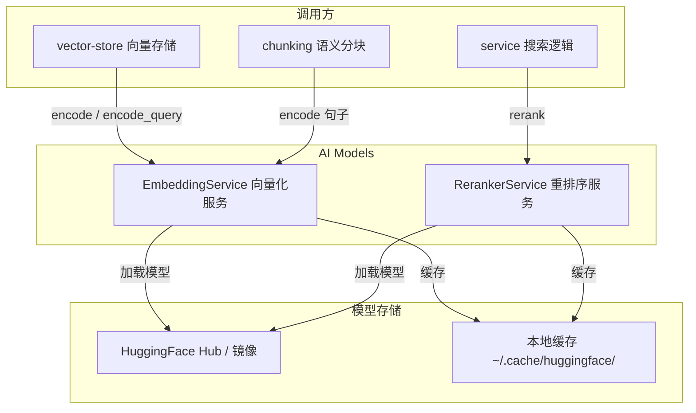
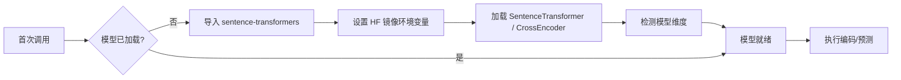

# AI Models 模块

## 简介

AI Models 模块封装了 wandering-rag-mcp 的两大 AI 推理服务：文本向量化（Embedding）和交叉编码重排序（Reranking）。两者均采用**单例模式 + 懒加载**策略，首次调用时才下载并加载 HuggingFace 模型，后续调用直接使用缓存，支持完全离线运行。

## 架构



## 核心组件

### EmbeddingService — 文本向量化

`core/embeddings.py::EmbeddingService`

单例类，负责将文本转换为固定维度的浮点向量。默认模型为 `Qwen3-Embedding-0.6B`，输出 1024 维归一化向量。

**关键特性：**

- **懒加载**：`_ensure_loaded()` 在首次调用时初始化 `SentenceTransformer` 模型，通过 `HF_ENDPOINT` 环境变量自动配置 HuggingFace 中国镜像（`hf-mirror.com`）。
- **双编码接口**：
  - `encode(texts)` — 批量编码文本列表，用于文档导入时的向量化。
  - `encode_query(query)` — 单条查询编码，自动添加 `"query: "` 前缀，适配 Qwen3-Embedding 的非对称检索范式（短查询 vs 长文档）。
- **维度自检测**：加载模型后通过编码测试句子自动检测输出维度，无需硬编码。

```python
# 使用示例
embedder = EmbeddingService()
vectors = embedder.encode(["文本A", "文本B"])  # 批量编码
query_vec = embedder.encode_query("搜索问题")    # 查询编码
```

### RerankerService — 交叉编码重排序

`core/reranker.py::RerankerService`

单例类，使用 Cross-Encoder 模型对（查询, 文档）对进行精确的相关性评分，用于在向量检索的粗排结果上进行精排。

**关键特性：**

- **懒加载**：与 EmbeddingService 相同的初始化策略，首次调用时加载 `CrossEncoder` 模型。
- **rerank(query, candidates, top_n)** — 接收候选结果列表，构建（query, text）对，调用 `model.predict()` 批量评分，按分数降序排列后返回 top_n 结果。每个结果附加 `rerank_score` 字段。

```python
# 使用示例
reranker = RerankerService()
results = reranker.rerank("搜索问题", candidates, top_n=5)
# results 中每项包含 rerank_score 字段
```

## 模型加载流程



## 依赖关系

- **上游依赖**：无（底层模块）
- **被依赖**：[vector-store](vector-store.md)（调用 `encode` / `encode_query`）、[chunking](chunking.md)（语义分块调用 `encode`）、[service](service.md)（搜索时调用 `rerank`）
- **外部依赖**：`sentence-transformers`（提供 `SentenceTransformer` 和 `CrossEncoder`）、HuggingFace Hub（模型下载与缓存）
