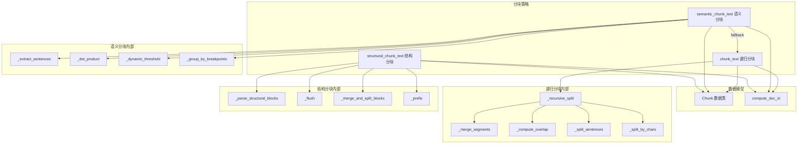
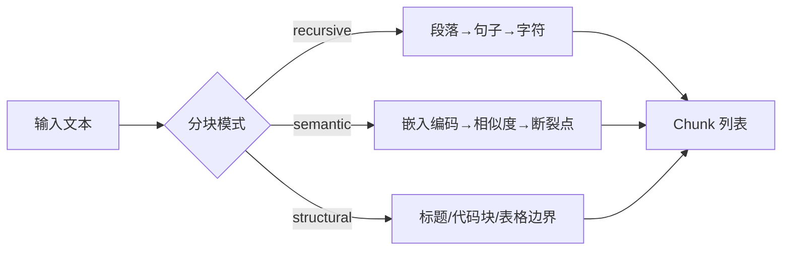

# Chunking 模块

## 简介

Chunking 模块是 wandering-rag-mcp 的文本分块引擎，负责将长文本拆分为适合向量化和语义搜索的小块。模块提供三种分块策略：递归字符分块、语义分块和结构分块，分别适用于不同场景和文档类型。

所有分块函数均返回统一的 `Chunk` 对象列表，包含文本内容、源文件路径、分块索引和文档 ID 等元数据。

## 架构

## 核心组件

### Chunk 数据类

`core/chunker.py::Chunk`

分块结果的基本单元，包含以下字段：

| 字段 | 类型 | 说明 |
|------|------|------|
| text | str | 分块文本内容 |
| source | str | 源文件路径 |
| chunk_index | int | 在源文档中的位置索引 |
| doc_id | str | 文档 ID（SHA256 前 16 位） |

### compute_doc_id

`core/chunker.py::compute_doc_id`

从文件路径计算稳定的文档 ID：先规范化路径（`normpath` + `abspath`），再计算 SHA256 哈希并取前 16 个字符。同一文件路径始终生成相同的 doc_id，用于分块 ID 命名（格式：`{doc_id}_{chunk_index}`）和文档删除时的块定位。

### 策略一：递归字符分块 — `chunk_text()`

默认分块策略，适用于大多数纯文本文件。

**流程：**

1. 调用 `_recursive_split()` 将文本按段落 → 句子 → 字符逐级拆分
2. `_split_sentences()` 使用标点符号（`.!?。！？`等）分割句子
3. `_split_by_chars()` 在句子内按字符数进一步拆分
4. `_merge_segments()` 将过小的片段合并，确保不超过 `chunk_size`
5. `_compute_overlap()` 在相邻块之间添加重叠内容，保持上下文连续性

默认参数：`chunk_size=500`，`chunk_overlap=50`。

### 策略二：语义分块 — `semantic_chunk_text()`

基于嵌入模型的智能分块，适用于长文档和主题多样的内容。

**流程：**

1. `_extract_sentences()` 将文本拆分为句子列表
2. 调用 [ai-models](ai-models.md) 的 `EmbeddingService.encode()` 对每个句子编码
3. `_dot_product()` 计算相邻句子的余弦相似度（向量已归一化，点积即余弦相似度）
4. `_dynamic_threshold()` 计算动态阈值：`mean - 1σ`，自动适应文档的相似度分布
5. `_group_by_breakpoints()` 在相似度低于阈值的位置断开，将句子分组
6. 超长组回退到 `_recursive_split()` 进行字符级拆分

**容错机制：** 如果嵌入模型加载失败，自动回退到递归字符分块。

### 策略三：结构分块 — `structural_chunk_text()`

尊重文档结构的高级分块策略，适用于 Markdown、代码文档等有明确结构的文件。

**流程：**

1. `_parse_structural_blocks()` 解析文本，识别 Markdown 标题、围栏代码块和表格作为结构边界
2. `_merge_and_split_blocks()` 合并过小的块，拆分超过 `chunk_size` 的大块
3. `_prefix()` 为每个块添加其所属标题前缀，确保 LLM 在检索时保留章节上下文

## 分块策略对比

| 策略 | 适用场景 | 优势 | 依赖 |
|------|----------|------|------|
| recursive | 纯文本、通用场景 | 快速、无模型依赖 | 无 |
| semantic | 长文档、多主题 | 按语义边界拆分 | [ai-models](ai-models.md) |
| structural | Markdown、代码文档 | 保留结构上下文 | 无 |

## 依赖关系

- **上游依赖**：[ai-models](ai-models.md)（语义分块时调用 `EmbeddingService`）
- **被依赖**：[service](service.md)（`ingest_file` / `ingest_content` 调用分块函数）
- **外部依赖**：无（递归分块和结构分块纯 Python 实现）
