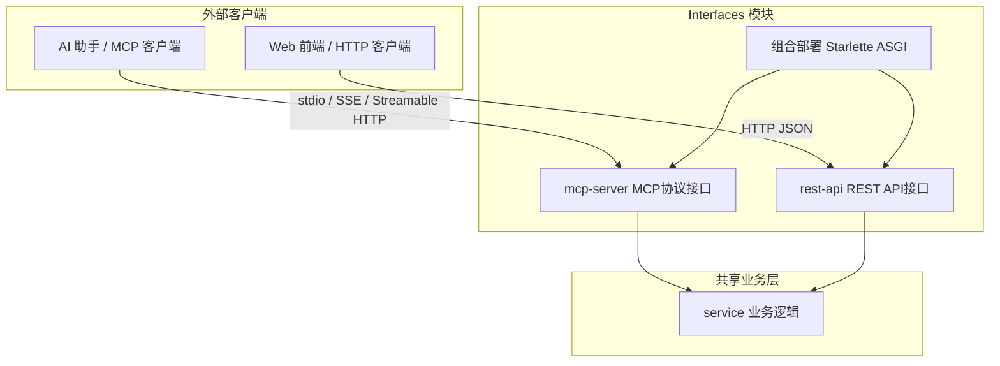

# Interfaces 模块总览

## 简介

Interfaces 模块是 wandering-rag-mcp 的外部接口层，提供两种互补的协议通道供外部系统访问 RAG 知识库：MCP（Model Context Protocol）协议和 REST API。两者共享同一个 [service](service.md) 业务逻辑层，可在同一端口组合部署，也可独立运行。

## 架构

## 子模块

### [mcp-server](mcp-server.md)

MCP 协议接口层，基于 FastMCP 框架。将业务逻辑封装为 9 个标准 MCP 工具，支持 stdio、SSE、Streamable HTTP 三种传输模式。在组合模式下可通过 `_create_combined_app()` 与 REST API 共享同一端口。

### [rest-api](rest-api.md)

HTTP JSON 接口层，基于 Starlette 框架。提供 9 个 RESTful 端点，支持文件上传（multipart）、语义搜索（POST JSON）、集合管理（CRUD）和配置管理。通过 CORS 中间件支持 Web 前端跨域访问。

## 接口对比

| 特性 | MCP Server | REST API |
|------|------------|----------|
| 协议 | MCP (stdio/SSE/HTTP) | HTTP REST |
| 目标用户 | AI 助手 | Web 前端 / 脚本 |
| 认证 | 无 | 无 |
| 文件上传 | 通过路径引用 | multipart/form-data |
| 组合部署 | 支持同一端口 | 支持同一端口 |
| CORS | 通过组合应用 | 内置中间件 |

## 依赖关系

- **子模块**：[mcp-server](mcp-server.md)、[rest-api](rest-api.md)
- **共同上游**：[service](service.md)
