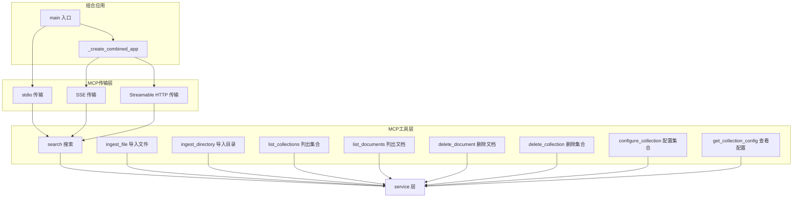
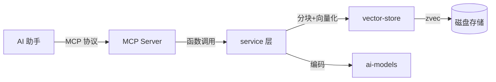

# MCP Server 模块

## 简介

MCP Server 模块是 wandering-rag-mcp 项目的 MCP（Model Context Protocol）协议接口层，基于 FastMCP 框架构建。它将 [service](service.md) 层的业务逻辑封装为标准 MCP 工具，供 AI 助手（如 Claude Desktop、QoderWork 等）通过 MCP 协议直接调用，实现知识库的文档导入、语义搜索和集合管理。

该模块支持三种传输模式：stdio（标准输入输出）、SSE（Server-Sent Events）和 Streamable HTTP，并可在同一端口同时暴露 REST API 与 MCP 端点。

## 架构

## 核心组件

### 入口与传输 — `main()`

`main()` 是服务器启动入口，根据命令行参数 `_args.mode` 选择传输模式：

- **stdio**：直接调用 `mcp.run(transport="stdio")`，适用于本地 AI 助手集成。
- **sse / streamable-http**：启动 Starlette ASGI 应用。若启用 `--api` 标志，调用 `_create_combined_app()` 在同一端口同时提供 MCP 和 REST API；否则仅启动纯 MCP 服务。

### 组合应用 — `_create_combined_app()`

该函数构建一个统一的 Starlette ASGI 应用，将 REST API 路由（来自 [rest-api](rest-api.md) 模块的 `create_api_routes()`）与 MCP 路由（SSE 或 Streamable HTTP）合并到同一端口。路由结构如下：

| 路径 | 功能 |
|------|------|
| `/api/*` | REST API（JSON） |
| `/mcp` | MCP Streamable HTTP |
| `/sse` | MCP SSE 端点 |
| `/messages/` | MCP SSE 消息端点 |

CORS 中间件通过 `get_cors_middleware()` 配置，支持通过 `RAG_CORS_ORIGINS` 环境变量自定义允许的来源。

### MCP 工具函数

所有 MCP 工具函数定义在 `server.py` 中，作为 FastMCP 实例的工具注册。每个工具函数将 MCP 协议参数转换为 [service](service.md) 层调用，并将结果格式化为人类可读的文本返回给 AI 助手。

| 工具 | 功能 | 关键参数 |
|------|------|----------|
| `search` | 语义搜索知识库 | query, top_k, collection, rerank, filter, expand_context |
| `ingest_file` | 导入单个文件 | filepath, collection, chunk_size, force, chunk_mode |
| `ingest_directory` | 批量导入目录 | dirpath, recursive, extensions, chunk_size |
| `list_collections` | 列出所有集合 | 无 |
| `list_documents` | 列出集合内文档 | collection |
| `delete_document` | 删除文档及其所有分块 | filepath, collection |
| `delete_collection` | 删除整个集合 | collection |
| `configure_collection` | 配置集合默认参数 | chunk_mode, chunk_size, chunk_overlap, rerank, description |
| `get_collection_config` | 查看集合配置 | collection |

### MCP 协议适配

MCP 协议不支持 `None` 值，因此工具函数使用哨兵值表示"未指定"：空字符串 `""` 表示字符串默认值，`0` 表示整数默认值，`-1` 表示负数默认值。工具函数内部将这些哨兵值转换为 `None` 后再传递给 service 层。

## 数据流

## 依赖关系

- **上游依赖**：[service](service.md)（业务逻辑）、[rest-api](rest-api.md)（路由定义，组合模式下）
- **外部依赖**：FastMCP（`mcp` 包）、Starlette（ASGI 框架）、uvicorn（HTTP 服务器）
- **配置**：命令行参数 `_args`（mode, host, port, api）
