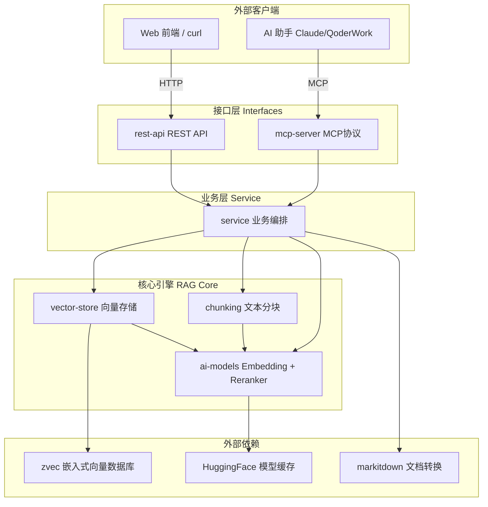
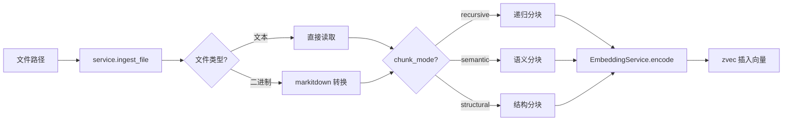
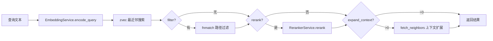

# wandering-rag-mcp 仓库总览

## 项目简介

wandering-rag-mcp 是一个基于 MCP（Model Context Protocol）的 RAG（Retrieval-Augmented Generation）知识库服务器。它将本地文件导入知识库，通过向量嵌入实现语义搜索，供 AI 助手通过 MCP 协议直接调用。项目采用纯 Python 实现，内置嵌入式向量数据库，无需外部服务依赖即可运行。

核心特性：

- 支持 MCP 协议（stdio/SSE/Streamable HTTP）和 REST API 双接口
- 三种文本分块策略：递归字符、语义、结构
- Qwen3-Embedding-0.6B 向量化 + 交叉编码器重排序
- 多集合管理，集合级配置持久化
- 二进制文档支持（PDF/DOCX/PPTX/XLSX 自动转换）
- 文件变更检测，增量导入

## 端到端架构



## 模块结构

项目分为两大顶层模块：

### [Interfaces](interfaces.md) — 外部接口层

提供 MCP 和 REST 两种协议通道，共享同一个业务逻辑层。

- **[mcp-server](mcp-server.md)** — MCP 协议接口，基于 FastMCP，9 个工具函数，支持 stdio/SSE/Streamable HTTP 三种传输模式
- **[rest-api](rest-api.md)** — HTTP JSON 接口，基于 Starlette，9 个 RESTful 端点，支持文件上传和 CORS

### [RAG Core](rag-core.md) — 核心引擎层

实现 RAG 管道的全部内部逻辑。

- **[ai-models](ai-models.md)** — AI 推理服务：EmbeddingService（Qwen3-Embedding-0.6B 向量化）+ RerankerService（交叉编码重排序），单例懒加载
- **[chunking](chunking.md)** — 文本分块引擎：递归字符分块、语义分块（嵌入模型动态阈值）、结构分块（Markdown/代码边界）
- **[vector-store](vector-store.md)** — 向量存储引擎：基于 zvec 嵌入式数据库，多集合管理，文档注册表，集合配置持久化
- **[service](service.md)** — 业务编排层：三层配置优先级、文件变更检测、二进制文档转换、上下文扩展搜索

## 典型工作流

### 文档导入



### 语义搜索



## 技术栈

| 组件 | 技术 |
|------|------|
| MCP 框架 | FastMCP (mcp >= 1.0) |
| ASGI 框架 | Starlette |
| 向量数据库 | zvec（嵌入式） |
| 嵌入模型 | Qwen3-Embedding-0.6B (sentence-transformers) |
| 重排序模型 | Cross-Encoder (sentence-transformers) |
| 文档转换 | markitdown |
| 传输协议 | stdio / SSE / Streamable HTTP |

## 数据目录结构

```
data/
├── {collection}/
│   ├── db/              ← zvec 向量数据
│   ├── _registry.json   ← 文档注册表
│   └── _config.json     ← 集合配置
└── _uploads/            ← 上传文件临时存储
```
