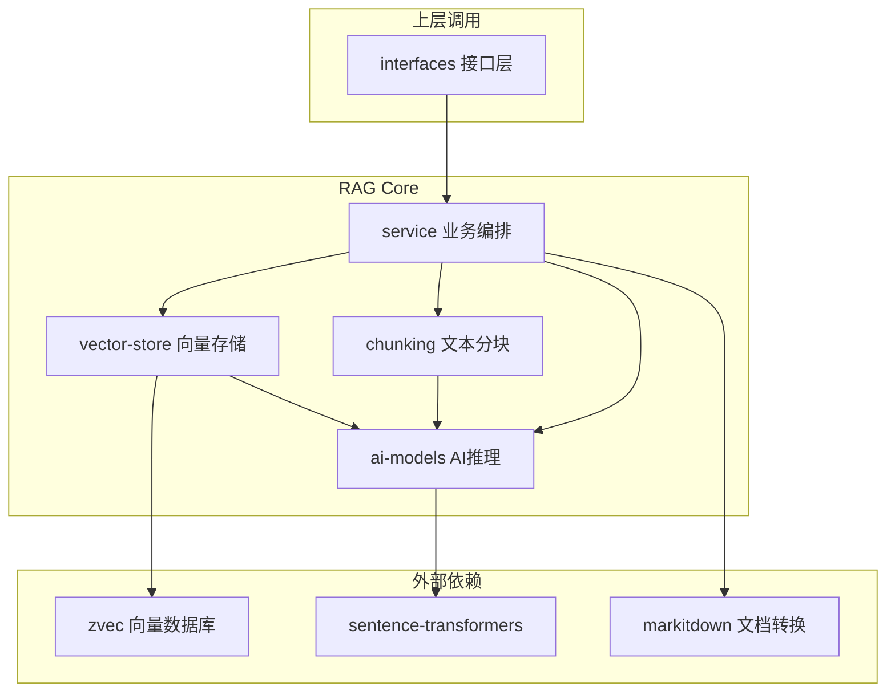
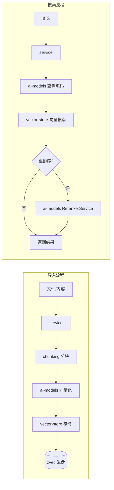

# RAG Core 模块总览

## 简介

RAG Core 模块是 wandering-rag-mcp 的核心引擎层，实现了 RAG（Retrieval-Augmented Generation）管道的全部内部逻辑：文本分块、向量化、存储、搜索和配置管理。它由四个紧密协作的子模块组成，自底向上构建了从向量存储到业务编排的完整链路。

## 架构

## 子模块

### [ai-models](ai-models.md)

AI 推理服务层，包含 `EmbeddingService`（文本向量化，Qwen3-Embedding-0.6B）和 `RerankerService`（交叉编码重排序）。两者均采用单例 + 懒加载模式，首次调用时从 HuggingFace 下载模型。

### [chunking](chunking.md)

文本分块引擎，提供三种分块策略：递归字符分块（默认，纯 Python）、语义分块（基于嵌入模型的动态阈值断裂检测）和结构分块（识别 Markdown 标题、代码块、表格边界）。

### [vector-store](vector-store.md)

向量存储引擎，基于 zvec 嵌入式数据库。管理多个集合，每个集合独立存储在 `data/{name}/` 目录。支持分块插入、语义搜索、相邻分块获取、文档删除和集合配置持久化。

### [service](service.md)

业务逻辑编排层，统一协调分块、向量化、存储和搜索流程。实现三层配置优先级（显式参数 > 集合配置 > 默认值）、文件变更检测（SHA256 哈希）、二进制文档转换（markitdown）和上下文扩展搜索。

## 数据流

## 依赖关系

- **子模块**：[ai-models](ai-models.md)、[chunking](chunking.md)、[vector-store](vector-store.md)、[service](service.md)
- **上层调用**：[interfaces](interfaces.md)
