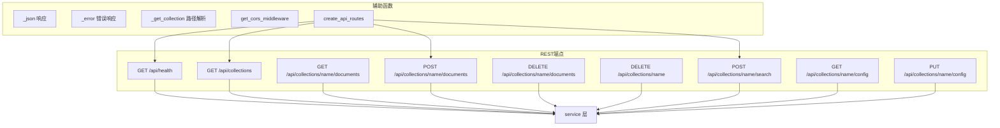
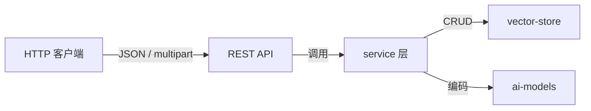

# REST API 模块

## 简介

REST API 模块为 wandering-rag-mcp 提供 HTTP JSON 接口，基于 Starlette 框架构建。它允许 Web 前端、外部应用或脚本通过标准 HTTP 方法管理知识库集合、上传文档和执行语义搜索，是 MCP 协议之外的补充访问通道。

该模块可与 MCP Server 共享同一端口（组合模式），也可独立部署。所有 API 路由无需认证，适合内网或受 CORS 保护的场景。

## 架构

## 核心组件

### 路由注册 — `create_api_routes()`

返回 Starlette `Route` 列表，定义所有 API 端点。路由表如下：

| 方法 | 路径 | 处理函数 | 功能 |
|------|------|----------|------|
| GET | `/api/health` | `health` | 健康检查 |
| GET | `/api/collections` | `list_collections` | 列出所有集合 |
| GET | `/api/collections/{name}/documents` | `list_documents` | 列出集合内文档 |
| POST | `/api/collections/{name}/documents` | `upload_document` | 上传并导入文件 |
| DELETE | `/api/collections/{name}/documents` | `delete_document` | 删除指定文档 |
| DELETE | `/api/collections/{name}` | `delete_collection` | 删除整个集合 |
| POST | `/api/collections/{name}/search` | `search_documents` | 语义搜索 |
| GET | `/api/collections/{name}/config` | `get_config` | 获取集合配置 |
| PUT | `/api/collections/{name}/config` | `update_config` | 更新集合配置 |

### CORS 中间件 — `get_cors_middleware()`

创建跨域资源共享中间件，通过环境变量 `RAG_CORS_ORIGINS`（默认 `*`）控制允许的来源。支持 GET/POST/PUT/DELETE/OPTIONS 方法和 Content-Type、Authorization 请求头。

### 辅助函数

- **`_json(data, status_code)`**：快捷构造 JSONResponse 成功响应。
- **`_error(message, status_code)`**：快捷构造 `{"error": message}` 格式的 JSONResponse 错误响应。
- **`_get_collection(request)`**：从 URL 路径参数中提取集合名称，默认返回 `"default"`。

### 文件上传 — `upload_document()`

支持 `multipart/form-data` 文件上传，处理流程：

1. 解析上传的 `file` 字段
2. 根据文件扩展名判断类型：
   - **二进制文档**（pdf/docx/pptx/xlsx）：保存到 `data/_uploads/{collection}/` 临时目录，通过 [service](service.md) 层调用 markitdown 转换后导入
   - **纯文本文件**（md/txt/py 等）：直接解码 UTF-8 后通过 `ingest_content` 导入
3. 支持通过 query 参数指定 `chunk_size` 和 `chunk_mode`

### 语义搜索 — `search_documents()`

接受 JSON 请求体，支持以下参数：

| 参数 | 类型 | 默认值 | 说明 |
|------|------|--------|------|
| query | string | 必填 | 搜索查询文本 |
| top_k | int | 5 | 返回结果数量 |
| rerank | bool | null | 是否使用交叉编码器重排序 |
| filter | string | "" | 按源文件路径过滤（glob 模式） |
| expand_context | int | 0 | 上下文扩展的相邻分块数 |

## 数据流

## 依赖关系

- **上游依赖**：[service](service.md)（业务逻辑层）
- **外部依赖**：Starlette（ASGI 框架）、python-multipart（表单解析）
- **被依赖**：[mcp-server](mcp-server.md)（组合模式下合并路由）
