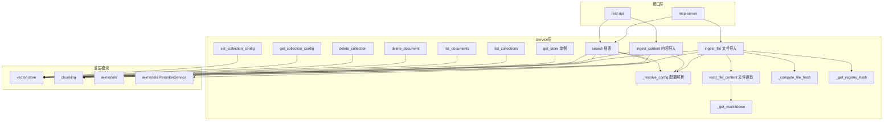
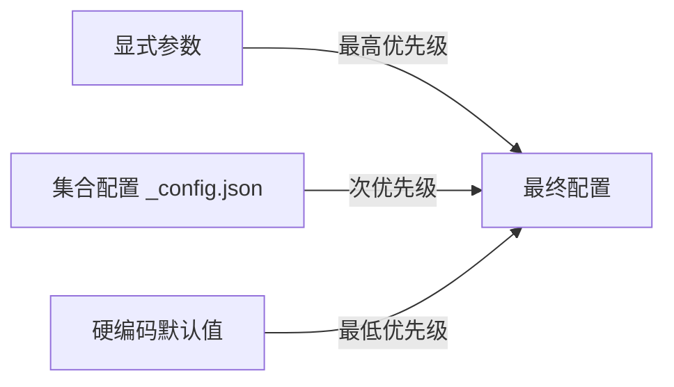

# Service 模块

## 简介

Service 模块是 wandering-rag-mcp 的核心业务逻辑层，作为 MCP 工具和 REST API 与底层存储之间的统一中间层。它编排了文档导入、分块、向量化、搜索和集合配置等完整工作流，实现了三层配置优先级解析、文件变更检测、二进制文档转换等关键功能。

所有外部接口（[mcp-server](mcp-server.md) 和 [rest-api](rest-api.md)）均通过 service 层的函数访问数据，不直接操作 [vector-store](vector-store.md)。

## 架构



## 核心组件

### 配置解析 — `_resolve_config()`

实现三层配置优先级：**显式参数 > 集合配置 > 硬编码默认值**。

```python
def _resolve_config(collection, **overrides) -> dict:
    store = get_store()
    config = store.get_collection_config(collection)  # 集合配置
    for key, value in overrides.items():
        if value is not None:      # 显式参数覆盖
            config[key] = value
    return config
```

该函数确保 `ingest_file`、`search` 等操作可以灵活地通过参数、集合配置或默认值获取分块模式、重排序等设置。

### 文件导入 — `ingest_file()`

完整的文件导入工作流：

1. **配置解析**：调用 `_resolve_config()` 获取最终的分块参数
2. **变更检测**：`_compute_file_hash()` 计算文件 SHA256 哈希，与 `_registry.json` 中存储的哈希对比，未变更则跳过
3. **内容读取**：`read_file_content()` 根据文件扩展名选择读取方式
4. **幂等处理**：先调用 `store.delete_document()` 删除旧分块
5. **分块**：根据 `chunk_mode` 选择 [chunking](chunking.md) 策略（recursive / semantic / structural）
6. **存储**：调用 `store.ingest_chunks()` 向量化并存储
7. **注册**：调用 `store.register_document()` 记录文档元信息

### 内容导入 — `ingest_content()`

与 `ingest_file` 类似，但接受纯文本内容而非文件路径，主要用于 REST API 的文件上传场景。内容存储到 `data/_uploads/{collection}/{filename}` 虚拟路径下。

### 语义搜索 — `search()`

完整的搜索工作流：

1. **配置解析**：确定是否启用重排序
2. **候选获取**：当需要过滤或重排序时，先获取 `max(top_k * 5, 20)` 个候选
3. **路径过滤**：使用 `fnmatch` 按源文件路径的 glob 模式过滤
4. **重排序**：若启用，调用 [ai-models](ai-models.md) 的 `RerankerService.rerank()` 精排
5. **上下文扩展**：若 `expand_context > 0`，通过 `store.fetch_neighbors()` 获取每个结果的前后相邻分块，合并为更完整的上下文

### 文件读取 — `read_file_content()`

智能文件读取，支持两种路径：

- **纯文本**（md/txt/py 等）：直接 UTF-8 读取
- **二进制文档**（pdf/docx/pptx/xlsx）：通过 `_get_markitdown()` 获取 MarkItDown 转换器，将二进制文档转为 Markdown 文本

### 辅助函数

| 函数 | 功能 |
|------|------|
| `get_store()` | 获取或创建 [vector-store](vector-store.md) 单例 |
| `_get_markitdown()` | 获取或创建 MarkItDown 转换器单例 |
| `_compute_file_hash(filepath)` | 计算文件内容的 SHA256 哈希 |
| `_get_registry_hash(filepath, collection)` | 从注册表读取上次导入时的文件哈希 |

## 配置优先级



## 依赖关系

- **上游依赖**：[vector-store](vector-store.md)（存储引擎）、[chunking](chunking.md)（文本分块）、[ai-models](ai-models.md)（重排序服务）
- **被依赖**：[mcp-server](mcp-server.md)（MCP 工具）、[rest-api](rest-api.md)（REST 端点）
- **外部依赖**：markitdown（二进制文档转换）、fnmatch（路径过滤，标准库）
