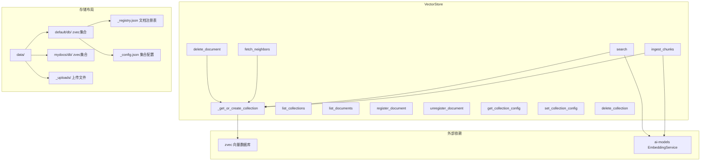
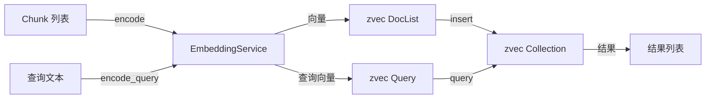

# Vector Store 模块

## 简介

Vector Store 模块是 wandering-rag-mcp 的向量存储引擎，基于 zvec 嵌入式向量数据库构建。它管理多个知识集合（Collection），每个集合独立存储在 `data/{collection_name}/` 目录下，支持文档的导入、搜索、删除以及集合级配置管理。

该模块是 [service](service.md) 层的底层存储抽象，屏蔽了 zvec API 的细节，向上层提供简洁的 Python 接口。

## 架构



## 存储布局

每个集合在磁盘上的目录结构：

```
data/
├── {collection}/
│   ├── db/              ← zvec 向量数据库文件
│   │   ├── manifest.0
│   │   └── ...
│   ├── _registry.json   ← 文档注册表（源路径、分块数、文件哈希）
│   ├── _config.json     ← 集合配置（分块模式、大小、重排序等）
│   └── _uploads/        ← 上传的二进制文件副本
└── _uploads/            ← REST API 上传的临时文件
```

`db/` 子目录存储 zvec 数据，与上层的 `_registry.json` 和 `_config.json` 分离，避免文件冲突。模块支持向后兼容：如果检测到旧版布局（zvec 数据直接存在集合根目录），会自动适配。

## 核心组件

### VectorStore 类

`core/vector_store.py::VectorStore`

单例风格的存储管理类，初始化时接收 `data_dir`（默认 `data/`）并创建 [ai-models](ai-models.md) 的 `EmbeddingService` 实例。

**集合管理：**

- `_get_or_create_collection(name)` — 打开已有集合或创建新集合。新集合的 Schema 包含：`embedding`（VECTOR_FP32，维度来自嵌入模型）、`text`（STRING）、`source`（STRING）、`chunk_index`（INT64）。集合缓存在内存字典 `_collections` 中，避免重复打开。
- `list_collections()` — 扫描 `data/` 目录，跳过 `_` 和 `.` 开头的内部目录。
- `delete_collection(name)` — 删除集合的整个目录（包括 zvec 数据、注册表、配置），并从内存缓存中移除。

**文档操作：**

- `ingest_chunks(chunks, collection)` — 将 [chunking](chunking.md) 模块产出的 `Chunk` 列表批量向量化并插入 zvec。调用 `EmbeddingService.encode()` 获取向量，构造 `zvec.DocList` 后插入。
- `search(query, top_k, collection)` — 将查询文本通过 `EmbeddingService.encode_query()` 向量化，然后在 zvec 中执行最近邻搜索。
- `fetch_neighbors(source, chunk_index, doc_id, n_before, n_after)` — 按 ID 模式 `{doc_id}_{index}` 获取相邻分块，用于搜索结果的上下文扩展。
- `delete_document(filepath, collection)` — 通过遍历 ID 模式 `{doc_id}_0` 到 `{doc_id}_9999` 定位并删除文档的所有分块。

**文档注册表：**

- `register_document(filepath, chunk_count, collection, file_hash)` — 在 `_registry.json` 中记录文档元信息，用于变更检测和文档列表。
- `list_documents(collection)` — 读取注册表返回文档列表及分块数。

**集合配置：**

- `get_collection_config(name)` — 读取 `_config.json`，与默认值合并。返回包含 `chunk_mode`、`chunk_size`、`chunk_overlap`、`rerank`、`description` 的字典。
- `set_collection_config(name, config)` — 更新配置并持久化到 `_config.json`。

## 数据流



## 依赖关系

- **上游依赖**：[ai-models](ai-models.md)（`EmbeddingService` 提供向量化）、[chunking](chunking.md)（`compute_doc_id` 用于文档删除）
- **被依赖**：[service](service.md)（通过 `get_store()` 单例访问）
- **外部依赖**：zvec（嵌入式向量数据库）
